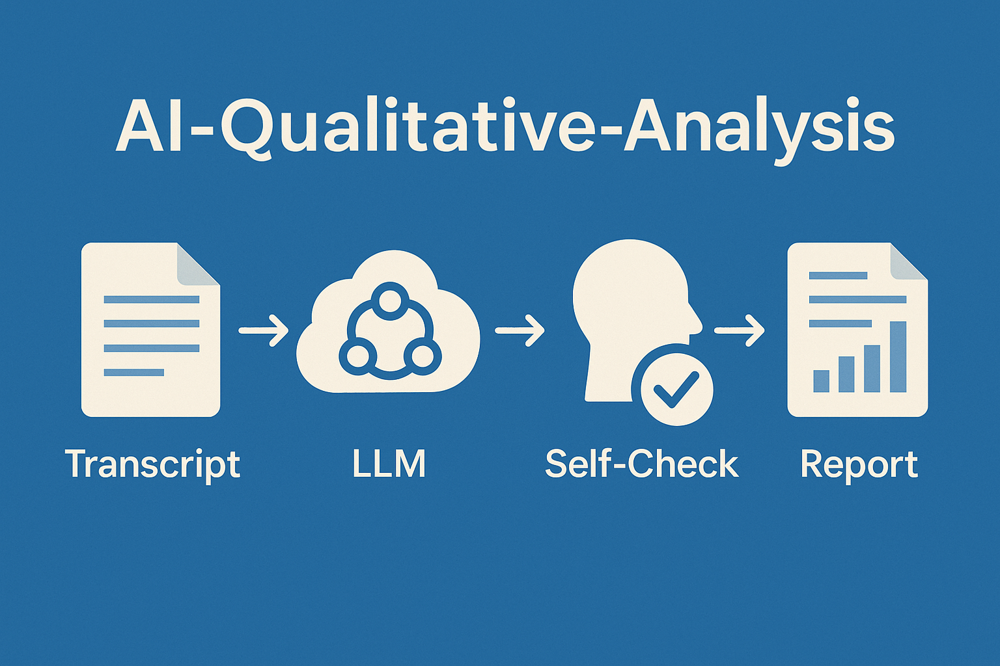

# AI Qualitative Analysis

**Version: 1.1.3**

> **Changelog (v1.1.1, June 2025):**
> - Automatically deletes old report files for each transcript before processing to avoid confusion with previous runs.
> - Final log message now indicates SUCCESS or FAILURE after validation attempts.
> - Minor log and output improvements for clarity.

Easily turn your qualitative customer interviews and survey transcripts into actionable, structured reports—powered by Azure OpenAI's large language models (LLMs) and the Microsoft Customer Engagement Model (MCEM).

**Includes a human-in-the-loop validation step to mitigate LLM hallucinations and ensure all insights are grounded in the original transcript.**

## Process Flow: Reliable, Actionable Analysis (Practical, Not Perfect)

To ensure every report is accurate, trustworthy, and ready for business use, this tool combines advanced AI with both automated and human validation steps. **The validation process is designed to be practical, not perfect:** the LLM is instructed to pass reports that are "very accurate" and complete for business use, not flawless. Most transcripts pass in 1-2 turns, making the workflow efficient and realistic for real-world use.

**Process Flow:**

1. **Transcript Collection**
   - Place your `.txt` interview or survey files in the input folder.

2. **Automated LLM Analysis**
   - The script uses Azure OpenAI (GPT-4) to generate a structured draft report based on your chosen template.

3. **LLM Self-Check & Validation (Practical, Not Perfect)**
   - The AI reviews its own output, checking for completeness, missing quotes, and alignment with the transcript (using built-in prompt-based validation).
   - The LLM is explicitly instructed to reply with ONLY 'VALID' if the report is complete and accurate for business use, even if not perfect. This ensures the validation loop is practical and does not require endless revisions for minor or subjective issues.
   - Most transcripts pass validation in 1-2 turns; only rare cases require a second revision.

4. **Human Review & Approval**
   - You review the draft report, ensuring:
     - All key insights and quotes are present and accurate
     - Context and attributions are correct
     - No sensitive or confidential information is mishandled
     - The analysis truly reflects the original transcript and your business framework
   - Any hallucinated, fabricated, or misattributed content is corrected or removed.

5. **Finalized, Shareable Report**
   - The validated report is saved in Markdown and Word formats, ready to share with stakeholders or use for decision-making.

**Why this matters:**
- LLMs can sometimes generate plausible-sounding but unsupported content (hallucinations).
- Automated and human validation together ensure all findings are evidence-based and actionable, maintaining trust and business value.
- The practical validation approach ensures the workflow is efficient and avoids unnecessary iterations.

> **Best Practice:** Always review and verify LLM-generated reports before sharing or acting on the insights.

---

## What Does This Project Do?

This tool streamlines the analysis of qualitative interviews and open-ended survey responses. It uses Azure OpenAI (GPT-4) to:
- Extract key insights, direct quotes, and metrics from transcripts
- Organize findings using your chosen business framework (MCEM provided as an example)
- Generate draft reports in both Markdown and Word formats
- Handle even very large transcripts by automatically chunking and consolidating results

**Minimize manual effort while maintaining quality—the tool generates structured drafts for your review, combining AI efficiency with human expertise.**

## Who Is This For?
- Customer success, sales, and research teams who run interviews or collect open-ended survey feedback
- Anyone who needs to quickly turn qualitative data into structured, actionable insights
- Users who want to leverage LLMs for business analysis without writing code

## How It Works
1. Place your `.txt` interview or survey transcript in the `transcripts/` folder.
2. **Optional but Recommended**: Review and customize the analysis template and prompt configuration:
   - Check `AnalysisTemplate-Improved.txt` to understand the default structure
   - Modify sections and prompts to match your business framework
   - Edit prompt templates in the `prompts/` folder (`system.txt`, `initial_analysis.txt`, `revision.txt`, `validation.txt`) to adjust LLM instructions, validation, and revision behavior
   - Add or remove sections based on your analysis needs
   - Adjust guidance for handling sensitive information
3. Run the script (`python main.py`).
4. Find your structured analysis in the `reports/` folder.
5. **Important**: Review and verify the generated reports:
   - Cross-check key insights with the original transcript
   - Verify that quotes are accurate and in proper context
   - Ensure all sensitive information is appropriately handled
   - Make any necessary adjustments before sharing

The script uses your chosen template to ensure every report is complete, consistent, and aligned with your business framework. While the AI analysis is sophisticated, human oversight remains essential for ensuring accuracy and appropriateness of the final output.

## Key Features
- **LLM-Powered Analysis:** Uses Azure OpenAI (GPT-4) to process qualitative data
- **MCEM Framework:** Organizes findings by Microsoft Customer Engagement Model stages
- **Direct Quotes & Metrics:** Preserves customer voice and quantitative feedback
- **Handles Large Files:** Automatically chunks and consolidates long transcripts
- **Multi-format Output:** Generates both Markdown and Word reports
- **Continuous Template Improvement:** The analysis template is refined over time for better results

## Quick Start

1. **Set up your environment:**
   - Clone this repository
   - Install Python 3.x if you haven't already
   - Install [Pandoc](https://pandoc.org/installing.html) for Word document conversion

2. **Configure Azure OpenAI:**
   - Create a file named `.env` in the project root
   - Add your Azure OpenAI credentials:
     ```
     AZURE_OPENAI_ENDPOINT=your_endpoint
     AZURE_OPENAI_API_KEY=your_api_key
     AZURE_OPENAI_DEPLOYMENT=your_deployment
     AZURE_OPENAI_API_VERSION=your_api_version
     ```

3. **Install Python dependencies:**
   ```bash
   pip install -r requirements.txt
   ```

4. **Prepare your transcripts:**
   - Save your interview/survey transcripts as plain text (`.txt`) files
   - Place them in the `transcripts/` folder
   - Make sure your transcripts are properly formatted with clear speaker indicators
   - Remove any sensitive or confidential information

5. **Configure analysis (optional):**
   - Review `config.yaml` for customization options
   - Check `AnalysisTemplate.txt` for the analysis structure
   - Adjust settings as needed for your use case

6. **Run the analysis:**
   ```bash
   python main.py
   ```

7. **Access your reports:**
   - Find generated reports in the `reports/` folder
   - Each transcript gets two files:
     - `{transcript_name}_analysis.md` (Markdown format)
     - `{transcript_name}_analysis.docx` (Word format)
   - For each transcript, the actual LLM prompts used (with variables filled in) are also saved in the `reports/` folder for troubleshooting and auditability.
   - Review the reports for accuracy and completeness

## Environment Variables

The following environment variables must be set in your `.env` file:

| Variable                    | Description                                 |
|-----------------------------|---------------------------------------------|
| AZURE_OPENAI_ENDPOINT       | Your Azure OpenAI resource endpoint URL      |
| AZURE_OPENAI_API_KEY        | Your Azure OpenAI API key                   |
| AZURE_OPENAI_DEPLOYMENT     | The deployment name for your GPT-4 model    |
| AZURE_OPENAI_API_VERSION    | The API version to use (e.g., 2024-02-15)   |

Example `.env` file:
```
AZURE_OPENAI_ENDPOINT=your_endpoint
AZURE_OPENAI_API_KEY=your_api_key
AZURE_OPENAI_DEPLOYMENT=your_deployment
AZURE_OPENAI_API_VERSION=your_api_version
```

For more details, see the [Azure OpenAI documentation](https://learn.microsoft.com/en-us/azure/ai-services/openai/overview) on how to obtain these values and set up your resource.

## Process Flow & Validation (LLM + Human-in-the-Loop)

This tool is designed to mitigate LLM hallucinations and ensure high-quality qualitative analysis through a clear, multi-step process. **The validation loop is practical, not perfect: the LLM is instructed to pass reports that are very accurate and complete for business use, not flawless.**

1. **Transcript Collection**: Load each transcript from the specified input folder.
2. **Automated LLM Analysis**: Use Azure OpenAI (GPT-4) to generate a draft report for each transcript, following a customizable template (default: MCEM framework).
3. **LLM Self-Check & Validation (Practical, Not Perfect)**: The LLM performs a self-validation step to check for consistency and completeness. It is instructed to reply 'VALID' if the report is complete and accurate for business use, even if not perfect.
4. **Human Review & Approval**: Users are prompted to review each generated report for accuracy, context, and completeness. This step is essential to mitigate hallucinations and ensure the final output is trustworthy.
5. **Finalized, Shareable Report**: Approved reports are saved in Markdown and Word formats, ready for sharing.

**Logs**: The tool provides clear, sectioned log messages for each transcript, announcing each process step and summarizing the batch at the end. This makes the process transparent and auditable.

## Hallucination Mitigation & Human Validation

- **LLM Self-Check**: After initial analysis, the LLM performs a self-validation step to catch inconsistencies or missing information. The validation prompt is designed to be practical, not require perfection, and most transcripts pass in 1-2 turns.
- **Human-in-the-Loop**: Every report requires human review and approval before being finalized. This is clearly announced in the logs and documentation.
- **Process Transparency**: Logs and output files are organized to make each step and its outcome clear, supporting traceability and auditability.

## Folder Structure

```
├── main.py                        # Main script to run
├── AnalysisTemplate.txt           # Default analysis template (customizable)
├── AnalysisTemplate-Original.txt  # Original/backup template
├── config.yaml                    # Configuration (chunk size, output, etc.)
├── requirements.txt               # Python dependencies
├── transcripts/                   # Place your input .txt files here
│   └── README.md                  # Explains transcript requirements and user guidelines
├── reports/                       # Output reports (Markdown, Word, and actual prompts used)
│   └── README.md                  # Details output types, validation feedback, and troubleshooting
├── prompts/                       # LLM prompt templates (system, initial, revision, validation)
│   ├── system.txt
│   ├── initial_analysis.txt
│   ├── revision.txt
│   ├── validation.txt
│   └── README.md                  # Describes each prompt template and customization best practices
├── utils/                         # Utility modules (env, file, config)
├── processing/                    # Transcript processing logic
├── conversion/                    # Markdown to Word conversion
├── tests/                         # Unit tests
└── banner.png                     # Project banner
```

## Prompt Templates Overview

The pipeline uses external prompt templates stored in the `prompts/` folder. Each template serves a specific function in the LLM-driven analysis and validation process:

- **system.txt**: Provides the system prompt for the LLM, defining its role, tone, and the MCEM-based analysis structure. This prompt is sent as the `system` message in every LLM call to ensure consistent, expert-level output.

- **initial_analysis.txt**: Template for the initial user prompt that instructs the LLM to analyze a transcript using the MCEM framework. It includes formatting and content requirements, and the transcript is inserted at runtime.

- **revision.txt**: Used when the initial or revised report is found to be incomplete or inaccurate. This prompt instructs the LLM to revise the previous report, addressing specific issues identified during validation. It includes the transcript, previous report, and a list of issues to fix.

- **validation.txt**: Template for validating the completeness and accuracy of the generated report. The LLM is asked to compare the transcript and report, list any omissions or inaccuracies, and suggest corrections. If the report is complete, the LLM replies with 'VALID'.

- **README.md**: Describes each prompt template and provides best practices for customization.

All prompt templates are fully externalized for transparency and easy customization. The actual prompts used (with variables filled in) are saved to the `reports/` folder for troubleshooting and auditability.

## Configuration & Customization
- **Analysis Framework:** While the default template uses MCEM (Microsoft Customer Engagement Model), you can customize `AnalysisTemplate.txt` to align with any business framework:
  - Sales methodologies (SPIN, Challenger, etc.)
  - Customer journey frameworks
  - Industry-specific analysis models
  - Your organization's proprietary frameworks
- **Templates:** Modify template structure, sections, and prompts to:
  - Focus on specific business metrics
  - Align with your reporting standards
  - Extract domain-specific insights
- **Config:** Use `config.yaml` to adjust:
  - Chunk size for processing large files
  - Output formats and styling
  - Analysis parameters
- **Environment:** All sensitive info is kept in `.env` (never committed)

Using an established framework like MCEM helps structure the AI's analysis in a way that makes insights immediately actionable within your existing business processes.

## Why Use This?
- **Save hours** on manual analysis and reporting while maintaining quality through expert review
- **Ensure consistency** across all your qualitative research with standardized templates
- **Leverage LLMs** for initial analysis—no prompt engineering required
- **Human-in-the-loop:** Combine AI efficiency with human expertise and judgment
- **Ready for business:** Output is formatted for easy review and sharing with stakeholders

## FAQ
**Q: What kinds of transcripts can I use?**
A: Any plain text file—interviews, open-ended survey responses, or meeting notes.

**Q: Is my data secure?**
A: Your transcripts are processed locally and only sent to Azure OpenAI via secure API calls. `.env` and transcript files are excluded from version control.

**Q: Can I use my own analysis template?**
A: Yes! You can either:
1. Modify the default template (`AnalysisTemplate.txt`)
2. Create a new template file and update the `template_path` in `config.yaml`
3. Use the original template (`AnalysisTemplate-Original.txt`) by changing the path in `config.yaml`

**Q: How accurate is the AI analysis?**
A: While the AI provides high-quality initial analysis, it may occasionally misinterpret context or miss nuances. Always review the generated reports, especially:
- Check quotes for accuracy and context
- Verify metrics and numerical claims
- Ensure sensitive information is handled appropriately
- Cross-reference key findings with the original transcript

**Q: What if the AI makes a mistake?**
A: You can:
1. Edit the generated reports directly
2. Adjust the analysis template to improve future results
3. Document common issues in `LEARNINGS.md`
4. File an issue if you find systematic problems

## Support & Best Practices
- Follows Microsoft Azure and MCEM best practices
- See `DECISIONS.md` for architectural choices
- See `LEARNINGS.md` for implementation insights and lessons

---

## Changelog

See [CHANGELOG.md](CHANGELOG.md) for a full version history and feature list.

**Privacy Note:**
- The `transcripts/` and `reports/` folders are included in `.gitignore` by default to prevent accidental publishing of PII or sensitive data. Always verify your `.gitignore` settings before sharing or publishing this repository.

*Turn your qualitative data into business value—fast, accurate, and repeatable.*

## Codebase Flow & Diagrams

For a detailed, step-by-step breakdown of the processing pipeline—including high-level diagrams, validation/revision loop, and large transcript handling—see [flow.md](flow.md).

This document provides:
- Visual diagrams of the main pipeline and validation loop
- A detailed, code-accurate description of each processing step
- Explanation of large transcript chunking and consolidation
- Output file structure and auditability notes
